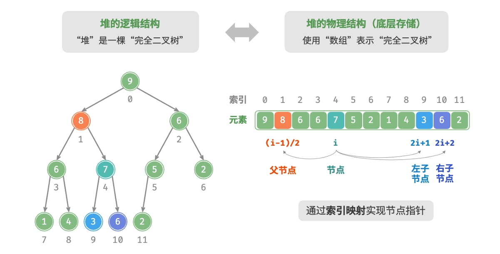

## 堆
一种完全二叉树，
小顶堆（minheap）：任意节点的值≤其子节点的值。
大顶堆（maxheap）：任意节点的值≥其子节点的值。

### 堆的实现
完全二叉树适合数组表示，因此堆十分适合数组实现
给定索引𝑖，其左子节点的索引为2𝑖+1，右子节点的索引为2𝑖+2，父节点的索引为
(𝑖 −1)/2（向下整除）。当索引越界时，表示空节点或节点不存在。
因此，对于一个堆获取其对应索引：

封装函数：
```cpp
int left(int i)
{
    return 2*i+1;
}

int right(int i)
{
    return 2*i+2;
}

int parent(int i)
{
    return (i-1)/2;
}
```
**访问堆顶**:
```cpp
int peek(){
    return 0;
}
```
**添加新元素**：
我们首先将其添加到堆底。添加之后，由于val可能大于堆中其他元素，堆的成立条件可能已被破坏，因此需要修复从插入节点到根节点的路径上的各个节点，这个操作被称为堆化(heapify)。
```cpp
void push(int val){
    maxHeap.push_back(val);
    // 自底而上的堆化
    maxHeap.siftUp(size()-1);
}
void siftUp(int i)
{
    while(true)
    {
        int p = parent(i);

        if(p<0||maxHeap[i]<=maxHeap[p])
            break;
        else if
            swap(i,p);
    }
    i = p;
}
```
堆化后的堆符合最大堆规则

**堆顶出堆**
将堆顶核堆底交换，堆底出堆，然后对堆顶元素堆化：
```cpp
void pop()
{
    if(isEmpty())
        throw out_of_range("堆为空");
    swap(maxHeap[0],maxHeap(size()-1));
    maxHeap.pop_back();
    siftDown(0);
}
void siftDown(int i)
{
    while(true)
    {
        int l = left(i), r = right(i), m = i;
        if(l<size()&&maxHeap[l]>maxHeap[m])
            m = l;
        if(r<size()&&maxHeap[r]>maxHeap[m])
            m = r;
        if(m == i)
            break;
        swap(maxHeap[m,i]);
        i = m;
    }
}
```
**构造函数**
使用数组构造：
1. 将数组原封不动入堆
2. 从下往上逐个堆化
每当堆化一个节点后，以该节点为根节点的子树就形成一个合法的子堆。而由于是倒序遍历，因此堆是“自下而上”构建的。
之所以选择倒序遍历，是因为这样能够保证当前节点之下的子树已经是合法的子堆，这样堆化当前节点才是有效的。
值得说明的是，由于叶节点没有子节点，因此它们天然就是合法的子堆，无须堆化。

```cpp
MaxHeap(vector<int> nums)
{
    MaxHeap = nums;
    for(int i = MaxHeap[size()-1]; i>=0; i--)
    {
        SiftDown(i);
    }
}
```

### TOP-K问题
有了堆后处理TOP-K问题就很简单了：
小顶堆的性质是：堆顶元素一定是当前最小元素，因此先使用数组前k个元素形成一个小顶堆，然后判断堆顶元素与当前元素的大小，如果堆顶元素小于当前元素，堆顶出堆，当前元素入堆，以此类推；
```cpp
priority_queue<int, vector<int>, greater<int>> TopK(vector<int> nums)
{
    priority_queue<int, vector<int>, greater<int>> heap;
    for(int i = 0; i < k; i++)
        heap.push(nums[i]);

    for(int i = k-1; i < size(nums); i++){
        if(heap.top()<nums[i]){
            heap.pop();
            heap.push(nums[i]);
        }
    }
    return heap;
}
```